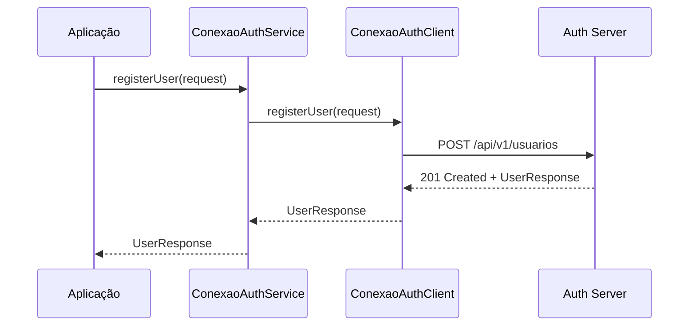
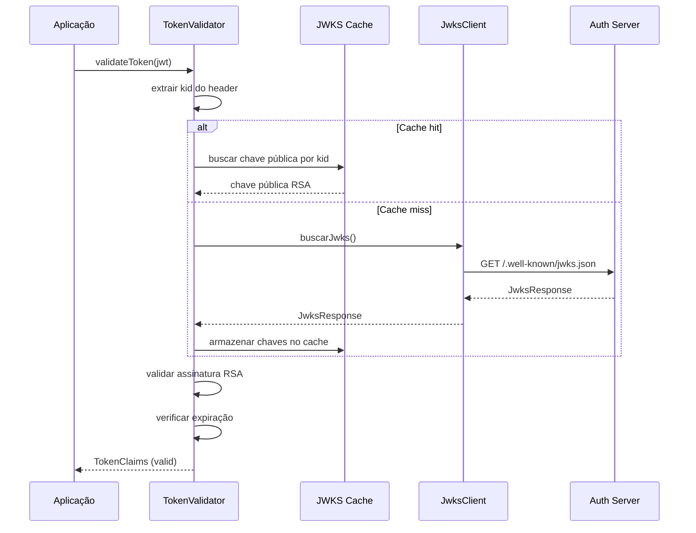
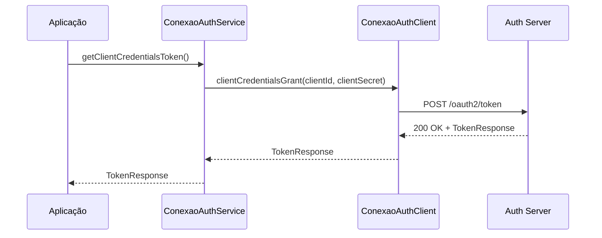

# Arquitetura: Spring Boot Starter SDK para Conexão Auth

**Versão:** 1.0.0
**Data:** 27 de Dezembro de 2025
**Status:** Proposta
**Autor:** Tech Lead - Arquiteto de Software Sênior

---

## 📋 Índice

1. [Visão Geral](#1-visão-geral)
2. [Objetivos](#2-objetivos)
3. [Arquitetura do Starter](#3-arquitetura-do-starter)
4. [Componentes Principais](#4-componentes-principais)
5. [Estrutura de Pacotes](#5-estrutura-de-pacotes)
6. [Configuração e Auto-Configuração](#6-configuração-e-auto-configuração)
7. [DTOs e Modelos](#7-dtos-e-modelos)
8. [Exceções da SDK](#8-exceções-da-sdk)
9. [Diagramas de Sequência](#9-diagramas-de-sequência)
10. [Exemplo de Uso](#10-exemplo-de-uso)
11. [Critérios de Aceite](#11-critérios-de-aceite)
12. [Próximos Passos](#12-próximos-passos)

---

## 1. Visão Geral

### 1.1 Propósito

O **Conexão Auth Starter SDK** é um **Spring Boot Starter** que fornece integração simplificada entre aplicações terceiras e o microserviço de identidade Conexão Auth. O SDK abstrai a complexidade de comunicação OAuth 2.0, validação de tokens JWT e gestão de identidade, permitindo que desenvolvedores adicionem autenticação e autorização com apenas algumas linhas de configuração.

### 1.2 Público-Alvo

- **Desenvolvedores de Aplicações Spring Boot**: Que precisam integrar suas aplicações ao ecossistema de identidade Conexão Auth
- **Equipes de Microserviços**: Que utilizam OAuth 2.0 e JWT para comunicação entre serviços
- **Sistemas Legados**: Que precisam ser modernizados com autenticação centralizada

### 1.3 Problema Solucionado

Sem o SDK, para integrar uma aplicação ao Conexão Auth, o desenvolvedor precisaria:
- Configurar manualmente clientes Feign para cada endpoint
- Implementar validação JWT/JWKS manualmente
- Gerenciar tokens e refresh tokens
- Tratar erros de comunicação
- Configurar timeouts e retry logic

Com o Starter SDK, tudo isso é automático!

---

## 2. Objetivos

### 2.1 Objetivos Funcionais

- ✅ Fornecer **Feign Client** declarativo para comunicação com o Auth Server
- ✅ Implementar **validação de JWT via JWKS** local (sem chamadas extras)
- ✅ Oferecer **Client Credentials flow** para autenticação de serviço-a-serviço
- ✅ Expor serviços de alto nível para gestão de usuários, realms e roles
- ✅ Traduzir erros HTTP em **exceções de negócio significativas**
- ✅ Suportar **configuração via application.yml** com propriedades customizadas
- ✅ Ser **stateless e thread-safe**

### 2.2 Objetivos Não-Funcionais

| NFR | Descrição | Métrica |
|-----|-----------|---------|
| **Performance** | Validação JWT deve ser rápida (< 5ms) | < 5ms por token |
| **Disponibilidade** | SDK deve ser resiliente a falhas de rede | Retry 3x com exponential backoff |
| **Segurança** | Validação local via JWKS (sem chamada ao auth server) | 100% local |
| **Compatibilidade** | Spring Boot 3.x e Java 21 | SB 3.2+, Java 21+ |
| **Simplicidade** | Configuração mínima: apenas propriedades | < 10 linhas de config |
| **Documentação** | 100% de código documentado em Javadoc | OpenAPI + Javadoc |
| **Testes** | Cobertura de testes > 80% | JaCoCo > 80% |
| **Code Quality** | Checkstyle, SpotBugs, PMD sem warnings | 0 warnings |

---

## 3. Arquitetura do Starter

### 3.1 Arquitetura em Camadas

```
┌─────────────────────────────────────────────────────────────┐
│                  Aplicação Consumidora                       │
│                  (Usa o Starter SDK)                         │
└───────────────────────┬─────────────────────────────────────┘
                        │
                        ▼
┌─────────────────────────────────────────────────────────────┐
│              Spring Boot Starter SDK                          │
├─────────────────────────────────────────────────────────────┤
│  Auto-Configuration Layer                                   │
│  ┌────────────────────────────────────────────────────────┐ │
│  │ ConexaoAuthAutoConfiguration                           │ │
│  │ • @ConditionalOnProperty("conexao.auth.enabled=true") │ │
│  │ • Registra beans de Feign Client                      │ │
│  │ • Configura TokenValidator                            │ │
│  │ • Configura AuthService                              │ │
│  └────────────────────────────────────────────────────────┘ │
├─────────────────────────────────────────────────────────────┤
│  Service Layer (Abstração para Usuário)                    │
│  ┌────────────────────────────────────────────────────────┐ │
│  │ • ConexaoAuthService                                   │ │
│  │   - registerUser()                                     │ │
│  │   - findUserByCpf()                                    │ │
│  │   - validatePermissions()                              │ │
│  │ • TokenValidator                                      │ │
│  │   - validateToken()                                   │ │
│  │   - extractClaims()                                   │ │
│  └────────────────────────────────────────────────────────┘ │
├─────────────────────────────────────────────────────────────┤
│  Client Layer (Feign)                                       │
│  ┌────────────────────────────────────────────────────────┐ │
│  │ ConexaoAuthClient (Interface Feign)                   │ │
│  │ • POST /api/v1/usuarios                               │ │
│  │ • GET /api/v1/usuarios/{cpf}                          │ │
│  │ • POST /oauth2/token (client credentials)             │ │
│  │ • GET /.well-known/jwks.json                          │ │
│  └────────────────────────────────────────────────────────┘ │
├─────────────────────────────────────────────────────────────┤
│  Configuration Properties                                   │
│  ┌────────────────────────────────────────────────────────┐ │
│  │ ConexaoAuthProperties                                 │ │
│  │ • base-url                                            │ │
│  │ • client-id                                           │ │
│  │ • client-secret                                       │ │
│  │ • realm-id                                            │ │
│  └────────────────────────────────────────────────────────┘ │
└───────────────────────┬─────────────────────────────────────┘
                        │
                        ▼
┌─────────────────────────────────────────────────────────────┐
│              Conexão Auth Server (Microserviço)              │
│  • OAuth 2.0 Authorization Server                           │
│  • JWT Token Issuer                                        │
│  • JWKS Endpoint                                          │
│  • REST API para usuários, realms, roles                  │
└─────────────────────────────────────────────────────────────┘
```

### 3.2 Princípios Arquiteturais

1. **Auto-Configuração**: Beans são registrados automaticamente via Spring Boot 3+ Auto-Configuration
2. **Condicional**: Beans só são criados se `conexao.auth.enabled=true`
3. **Desacoplamento**: SDK não interfere em beans da aplicação consumidora
4. **Type-Safe**: Configuration Properties com validação via Jakarta Validation
5. **Resiliência**: Feign com retry logic e timeouts configuráveis
6. **Thread-Safe**: Todos os componentes são stateless e thread-safe
7. **Exceções de Domínio**: Erros HTTP são traduzidos para exceções significativas da SDK

---

## 4. Componentes Principais

### 4.1 Auto-Configuration

**Classe:** `ConexaoAuthAutoConfiguration`

Responsável por:
- Detectar se as propriedades do SDK estão configuradas
- Registrar beans de Feign Client
- Configurar TokenValidator
- Configurar AuthService
- Configurar ErrorDecoder customizado para Feign

### 4.2 Feign Client

**Interface:** `ConexaoAuthClient`

Interface declarativa que define os endpoints do Auth Server:
- Registro de usuário
- Busca de usuário por CPF
- Obtenção de token (Client Credentials)
- Busca de JWKS

### 4.3 Token Validator

**Classe:** `TokenValidator`

Responsável por:
- Validar tokens JWT localmente via JWKS
- Extrair claims do token
- Verificar expiração e assinatura
- Cache de chaves públicas para performance

### 4.4 Auth Service

**Classe:** `ConexaoAuthService`

Serviço de alto nível exposto para a aplicação:
- `registerUser()` - Registrar novo usuário
- `findUserByCpf()` - Buscar usuário por CPF
- `validatePermissions()` - Validar permissões de usuário

### 4.5 Configuration Properties

**Classe:** `ConexaoAuthProperties`

Propriedades configuráveis via `application.yml`:
- `base-url` - URL do Auth Server
- `client-id` - Client ID OAuth2
- `client-secret` - Client Secret OAuth2
- `realm-id` - ID do Realm padrão
- `connection-timeout` - Timeout de conexão
- `read-timeout` - Timeout de leitura
- `jwks-cache-ttl` - TTL do cache JWKS

### 4.6 Error Decoder

**Classe:** `ConexaoAuthErrorDecoder`

Traduz respostas de erro HTTP em exceções da SDK:
- 401 → `UnauthorizedException`
- 403 → `ForbiddenException`
- 404 → `ResourceNotFoundException`
- 409 → `ConflictException`
- 500 → `ServerException`

---

## 5. Estrutura de Pacotes

```
com.plataforma.conexao.auth.starter
├── config/                          # Auto-Configuration
│   ├── ConexaoAuthAutoConfiguration.java
│   ├── FeignConfiguration.java
│   └── SecurityConfiguration.java
│
├── properties/                      # Configuration Properties
│   └── ConexaoAuthProperties.java
│
├── client/                          # Feign Clients
│   ├── ConexaoAuthClient.java
│   └── JwksClient.java
│
├── service/                         # Service Layer
│   ├── ConexaoAuthService.java
│   ├── AuthServiceImpl.java
│   ├── TokenValidator.java
│   └── TokenValidatorImpl.java
│
├── dto/                             # DTOs compartilhados
│   ├── request/                     # Requests Feign
│   │   ├── RegisterUserRequest.java
│   │   ├── ClientCredentialsRequest.java
│   │   └── FindUserByCpfRequest.java
│   └── response/                    # Responses Feign
│       ├── RegisterUserResponse.java
│       ├── UserResponse.java
│       ├── TokenResponse.java
│       └── JwksResponse.java
│
├── exception/                       # Exceções da SDK
│   ├── ConexaoAuthException.java
│   ├── UnauthorizedException.java
│   ├── ForbiddenException.java
│   ├── ResourceNotFoundException.java
│   ├── ConflictException.java
│   ├── ServerException.java
│   └── InvalidTokenException.java
│
├── decoder/                         # Feign Error Decoders
│   └── ConexaoAuthErrorDecoder.java
│
└── model/                           # Modelos internos
    └── TokenClaims.java             # Claims JWT extraídos

src/main/resources/
└── META-INF/
    └── spring/
        └── org.springframework.boot.autoconfigure.AutoConfiguration.imports
```

---

## 6. Configuração e Auto-Configuração

### 6.1 Registro de Auto-Configuration (Spring Boot 3+)

**Arquivo:** `src/main/resources/META-INF/spring/org.springframework.boot.autoconfigure.AutoConfiguration.imports`

```
com.plataforma.conexao.auth.starter.config.ConexaoAuthAutoConfiguration
```

### 6.2 Classe de Auto-Configuração

**Localização:** `src/main/java/com/plataforma/conexao/auth/starter/config/ConexaoAuthAutoConfiguration.java`

```java
package com.plataforma.conexao.auth.starter.config;

import com.plataforma.conexao.auth.starter.client.ConexaoAuthClient;
import com.plataforma.conexao.auth.starter.decoder.ConexaoAuthErrorDecoder;
import com.plataforma.conexao.auth.starter.properties.ConexaoAuthProperties;
import com.plataforma.conexao.auth.starter.service.ConexaoAuthService;
import com.plataforma.conexao.auth.starter.service.TokenValidator;
import feign.Logger;
import feign.Request;
import feign.Retryer;
import lombok.RequiredArgsConstructor;
import lombok.extern.slf4j.Slf4j;
import org.springframework.boot.autoconfigure.AutoConfiguration;
import org.springframework.boot.autoconfigure.condition.ConditionalOnProperty;
import org.springframework.boot.context.properties.EnableConfigurationProperties;
import org.springframework.cloud.openfeign.FeignClientBuilder;
import org.springframework.context.annotation.Bean;
import org.springframework.context.annotation.Import;

import java.util.concurrent.TimeUnit;

/**
 * Auto-Configuration do Conexão Auth Starter SDK.
 * Registra automaticamente beans se a propriedade conexao.auth.enabled=true.
 */
@Slf4j
@AutoConfiguration
@ConditionalOnProperty(prefix = "conexao.auth", name = "enabled", havingValue = "true")
@EnableConfigurationProperties(ConexaoAuthProperties.class)
@Import(FeignConfiguration.class)
@RequiredArgsConstructor
public class ConexaoAuthAutoConfiguration {

    private final ConexaoAuthProperties properties;

    /**
     * Cria bean de Feign Client para comunicação com Auth Server.
     */
    @Bean
    public ConexaoAuthClient conexaoAuthClient(FeignClientBuilder feignClientBuilder,
                                               ConexaoAuthErrorDecoder errorDecoder) {
        log.info("Configurando ConexaoAuthClient para URL: {}", properties.getBaseUrl());

        return feignClientBuilder
                .forType(ConexaoAuthClient.class, properties.getBaseUrl())
                .requestInterceptor(template -> {
                    template.header("X-Client-Id", properties.getClientId());
                    template.header("X-Realm-Id", properties.getRealmId());
                })
                .errorDecoder(errorDecoder)
                .options(new Request.Options(
                        properties.getConnectionTimeout(),
                        TimeUnit.MILLISECONDS,
                        properties.getReadTimeout(),
                        TimeUnit.MILLISECONDS,
                        true
                ))
                .retryer(new Retryer.Default(100, 1000, 3))
                .logLevel(Logger.Level.FULL)
                .target(ConexaoAuthClient.class);
    }

    /**
     * Cria bean de Token Validator.
     */
    @Bean
    public TokenValidator tokenValidator(ConexaoAuthClient conexaoAuthClient) {
        log.info("Configurando TokenValidator com cache TTL: {}ms",
                properties.getJwksCacheTtl());
        return new TokenValidator(conexaoAuthClient, properties.getJwksCacheTtl());
    }

    /**
     * Cria bean de Auth Service (abstração para usuário).
     */
    @Bean
    public ConexaoAuthService conexaoAuthService(ConexaoAuthClient conexaoAuthClient,
                                                 TokenValidator tokenValidator) {
        log.info("Configurando ConexaoAuthService");
        return new ConexaoAuthService(conexaoAuthClient, tokenValidator, properties);
    }

    /**
     * Cria bean de Error Decoder customizado.
     */
    @Bean
    public ConexaoAuthErrorDecoder conexaoAuthErrorDecoder() {
        log.info("Configurando ConexaoAuthErrorDecoder");
        return new ConexaoAuthErrorDecoder();
    }
}
```

### 6.3 Feign Configuration

**Localização:** `src/main/java/com/plataforma/conexao/auth/starter/config/FeignConfiguration.java`

```java
package com.plataforma.conexao.auth.starter.config;

import feign.codec.Decoder;
import feign.codec.Encoder;
import feign.jackson.JacksonDecoder;
import feign.jackson.JacksonEncoder;
import feign.okhttp.OkHttpClient;
import lombok.extern.slf4j.Slf4j;
import org.springframework.boot.autoconfigure.condition.ConditionalOnMissingBean;
import org.springframework.context.annotation.Bean;
import org.springframework.context.annotation.Configuration;

/**
 * Configuração do Feign Client.
 */
@Slf4j
@Configuration
public class FeignConfiguration {

    /**
     * Usa OkHttp como cliente HTTP para o Feign (mais performático que o padrão).
     */
    @Bean
    @ConditionalOnMissingBean
    public feign.Client feignClient() {
        log.info("Configurando OkHttp Client para Feign");
        return new OkHttpClient();
    }

    /**
     * Usa Jackson para encoder/decoder de JSON.
     */
    @Bean
    @ConditionalOnMissingBean
    public Encoder feignEncoder() {
        log.info("Configurando Jackson Encoder para Feign");
        return new JacksonEncoder();
    }

    @Bean
    @ConditionalOnMissingBean
    public Decoder feignDecoder() {
        log.info("Configurando Jackson Decoder para Feign");
        return new JacksonDecoder();
    }
}
```

### 6.4 Configuration Properties

**Localização:** `src/main/java/com/plataforma/conexao/auth/starter/properties/ConexaoAuthProperties.java`

```java
package com.plataforma.conexao.auth.starter.properties;

import jakarta.validation.constraints.NotBlank;
import jakarta.validation.constraints.NotNull;
import jakarta.validation.constraints.Positive;
import lombok.Data;
import org.springframework.boot.context.properties.ConfigurationProperties;
import org.springframework.validation.annotation.Validated;

/**
 * Propriedades de configuração do Conexão Auth Starter.
 * Configuráveis via application.yml.
 */
@Data
@Validated
@ConfigurationProperties(prefix = "conexao.auth")
public class ConexaoAuthProperties {

    /**
     * Habilita ou desabilita o Starter SDK.
     */
    @NotNull(message = "conexao.auth.enabled é obrigatório")
    private Boolean enabled = false;

    /**
     * URL base do Auth Server (ex: https://auth.example.com ou http://conexao-auth:8080).
     */
    @NotBlank(message = "conexao.auth.base-url é obrigatório")
    private String baseUrl;

    /**
     * Client ID OAuth2 para autenticação da aplicação.
     */
    @NotBlank(message = "conexao.auth.client-id é obrigatório")
    private String clientId;

    /**
     * Client Secret OAuth2 para autenticação da aplicação.
     */
    @NotBlank(message = "conexao.auth.client-secret é obrigatório")
    private String clientSecret;

    /**
     * ID do Realm padrão a ser usado nas operações.
     */
    @NotBlank(message = "conexao.auth.realm-id é obrigatório")
    private String realmId;

    /**
     * Timeout de conexão em milissegundos.
     */
    @Positive(message = "conexao.auth.connection-timeout deve ser positivo")
    private Integer connectionTimeout = 5000;

    /**
     * Timeout de leitura em milissegundos.
     */
    @Positive(message = "conexao.auth.read-timeout deve ser positivo")
    private Integer readTimeout = 10000;

    /**
     * TTL (Time To Live) do cache JWKS em milissegundos.
     * Padrao: 5 minutos (300000ms).
     */
    @Positive(message = "conexao.auth.jwks-cache-ttl deve ser positivo")
    private Long jwksCacheTtl = 300000L;
}
```

---

## 7. DTOs e Modelos

### 7.1 DTOs de Request

#### RegisterUserRequest

```java
package com.plataforma.conexao.auth.starter.dto.request;

import jakarta.validation.constraints.Email;
import jakarta.validation.constraints.NotBlank;
import jakarta.validation.constraints.Size;
import lombok.AllArgsConstructor;
import lombok.Data;
import lombok.NoArgsConstructor;

/**
 * DTO para registro de novo usuário via API do Auth Server.
 */
@Data
@NoArgsConstructor
@AllArgsConstructor
public class RegisterUserRequest {

    /**
     * Nome completo do usuário.
     */
    @NotBlank(message = "Nome é obrigatório")
    @Size(min = 3, max = 100, message = "Nome deve ter entre 3 e 100 caracteres")
    private String nome;

    /**
     * Email do usuário (deve ser único no sistema).
     */
    @NotBlank(message = "Email é obrigatório")
    @Email(message = "Email inválido")
    @Size(max = 255, message = "Email deve ter no máximo 255 caracteres")
    private String email;

    /**
     * Senha do usuário.
     */
    @NotBlank(message = "Senha é obrigatória")
    @Size(min = 8, message = "Senha deve ter no mínimo 8 caracteres")
    private String senha;

    /**
     * CPF do usuário (opcional, formato 11 dígitos).
     */
    private String cpf;

    /**
     * ID do Realm onde o usuário será criado.
     */
    @NotBlank(message = "Realm ID é obrigatório")
    private String realmId;

    /**
     * Lista de IDs de roles a serem associadas ao usuário.
     */
    private java.util.List<String> roleIds;

    /**
     * ID da empresa (opcional, para integração externa).
     */
    private String empresaId;

    /**
     * ID do tenant (opcional, para multi-tenancy).
     */
    private String tenantId;
}
```

#### ClientCredentialsRequest

```java
package com.plataforma.conexao.auth.starter.dto.request;

import lombok.AllArgsConstructor;
import lombok.Data;
import lombok.NoArgsConstructor;

/**
 * DTO para solicitação de token via Client Credentials Flow.
 */
@Data
@NoArgsConstructor
@AllArgsConstructor
public class ClientCredentialsRequest {

    /**
     * Grant type OAuth2.
     */
    private String grantType = "client_credentials";

    /**
     * Client ID.
     */
    private String clientId;

    /**
     * Client Secret.
     */
    private String clientSecret;

    /**
     * Escopos solicitados.
     */
    private String scope;
}
```

### 7.2 DTOs de Response

#### UserResponse

```java
package com.plataforma.conexao.auth.starter.dto.response;

import com.fasterxml.jackson.annotation.JsonProperty;
import lombok.AllArgsConstructor;
import lombok.Data;
import lombok.NoArgsConstructor;

import java.time.LocalDateTime;
import java.util.List;

/**
 * DTO de resposta para dados de usuário.
 */
@Data
@NoArgsConstructor
@AllArgsConstructor
public class UserResponse {

    /**
     * ID do usuário.
     */
    private String id;

    /**
     * Nome do usuário.
     */
    private String nome;

    /**
     * Email do usuário.
     */
    private String email;

    /**
     * CPF do usuário.
     */
    private String cpf;

    /**
     * ID do Realm do usuário.
     */
    @JsonProperty("realm_id")
    private String realmId;

    /**
     * Nome do Realm do usuário.
     */
    @JsonProperty("realm_nome")
    private String realmNome;

    /**
     * Lista de roles do usuário.
     */
    private List<String> roles;

    /**
     * Status do usuário (ATIVO, BLOQUEADO).
     */
    private String status;

    /**
     * Data de criação.
     */
    @JsonProperty("data_criacao")
    private LocalDateTime dataCriacao;

    /**
     * Data da última atualização.
     */
    @JsonProperty("data_ultima_atualizacao")
    private LocalDateTime dataUltimaAtualizacao;
}
```

#### TokenResponse

```java
package com.plataforma.conexao.auth.starter.dto.response;

import com.fasterxml.jackson.annotation.JsonProperty;
import lombok.AllArgsConstructor;
import lombok.Data;
import lombok.NoArgsConstructor;

/**
 * DTO de resposta para token OAuth2.
 */
@Data
@NoArgsConstructor
@AllArgsConstructor
public class TokenResponse {

    /**
     * Access Token JWT.
     */
    @JsonProperty("access_token")
    private String accessToken;

    /**
     * Token type (geralmente "Bearer").
     */
    @JsonProperty("token_type")
    private String tokenType;

    /**
     * Tempo de expiração em segundos.
     */
    @JsonProperty("expires_in")
    private Long expiresIn;

    /**
     * Escopos concedidos.
     */
    @JsonProperty("scope")
    private String scope;
}
```

#### JwksResponse

```java
package com.plataforma.conexao.auth.starter.dto.response;

import com.fasterxml.jackson.annotation.JsonProperty;
import lombok.AllArgsConstructor;
import lombok.Data;
import lombok.NoArgsConstructor;

import java.util.List;

/**
 * DTO de resposta para endpoint JWKS (JSON Web Key Set).
 */
@Data
@NoArgsConstructor
@AllArgsConstructor
public class JwksResponse {

    /**
     * Lista de chaves públicas RSA.
     */
    @JsonProperty("keys")
    private List<Jwk> keys;

    /**
     * JSON Web Key.
     */
    @Data
    @NoArgsConstructor
    @AllArgsConstructor
    public static class Jwk {
        /**
         * Key ID (kid).
         */
        private String kid;

        /**
         * Key Type (RSA).
         */
        private String kty;

        /**
         * Algorithm (RS256).
         */
        private String alg;

        /**
         * Use (sig - signature).
         */
        private String use;

        /**
         * Modulus (base64url).
         */
        private String n;

        /**
         * Exponent (base64url).
         */
        private String e;
    }
}
```

---

## 8. Exceções da SDK

### 8.1 Hierarquia de Exceções

```
RuntimeException
    └─ ConexaoAuthException (base)
        ├─ UnauthorizedException (401)
        ├─ ForbiddenException (403)
        ├─ ResourceNotFoundException (404)
        ├─ ConflictException (409)
        ├─ InvalidTokenException (token inválido/expirado)
        └─ ServerException (500+)
```

### 8.2 Implementação das Exceções

#### ConexaoAuthException

```java
package com.plataforma.conexao.auth.starter.exception;

import lombok.Getter;

/**
 * Exceção base para erros do Conexão Auth SDK.
 */
@Getter
public class ConexaoAuthException extends RuntimeException {

    private final int statusCode;

    public ConexaoAuthException(String message, int statusCode) {
        super(message);
        this.statusCode = statusCode;
    }

    public ConexaoAuthException(String message, Throwable cause, int statusCode) {
        super(message, cause);
        this.statusCode = statusCode;
    }
}
```

#### UnauthorizedException

```java
package com.plataforma.conexao.auth.starter.exception;

/**
 * Exceção lançada quando a requisição não está autorizada (401).
 */
public class UnauthorizedException extends ConexaoAuthException {

    public UnauthorizedException(String message) {
        super(message, 401);
    }
}
```

#### ForbiddenException

```java
package com.plataforma.conexao.auth.starter.exception;

/**
 * Exceção lançada quando o acesso é proibido (403).
 */
public class ForbiddenException extends ConexaoAuthException {

    public ForbiddenException(String message) {
        super(message, 403);
    }
}
```

#### ResourceNotFoundException

```java
package com.plataforma.conexao.auth.starter.exception;

/**
 * Exceção lançada quando um recurso não é encontrado (404).
 */
public class ResourceNotFoundException extends ConexaoAuthException {

    public ResourceNotFoundException(String message) {
        super(message, 404);
    }
}
```

#### ConflictException

```java
package com.plataforma.conexao.auth.starter.exception;

/**
 * Exceção lançada quando há conflito de dados (409).
 */
public class ConflictException extends ConexaoAuthException {

    public ConflictException(String message) {
        super(message, 409);
    }
}
```

#### InvalidTokenException

```java
package com.plataforma.conexao.auth.starter.exception;

/**
 * Exceção lançada quando um token JWT é inválido ou expirado.
 */
public class InvalidTokenException extends ConexaoAuthException {

    public InvalidTokenException(String message) {
        super(message, 0);
    }

    public InvalidTokenException(String message, Throwable cause) {
        super(message, cause, 0);
    }
}
```

#### ServerException

```java
package com.plataforma.conexao.auth.starter.exception;

/**
 * Exceção lançada quando há erro interno no servidor (500+).
 */
public class ServerException extends ConexaoAuthException {

    public ServerException(String message, int statusCode) {
        super(message, statusCode);
    }
}
```

---

## 9. Diagramas de Sequência

### 9.1 Fluxo de Registro de Usuário



### 9.2 Fluxo de Validação de Token (JWKS Local)



### 9.3 Fluxo Client Credentials Flow



---

## 10. Exemplo de Uso

### 10.1 Configuração application.yml

```yaml
conexao:
  auth:
    enabled: true
    base-url: https://auth.example.com
    # Para Docker/Service Discovery:
    # base-url: http://conexao-auth:8080
    client-id: meu-client-id
    client-secret: meu-client-secret
    realm-id: master
    connection-timeout: 5000
    read-timeout: 10000
    jwks-cache-ttl: 300000
```

### 10.2 Exemplo de Uso no Código da Aplicação

#### Registro de Usuário

```java
package com.minha.aplicacao.controller;

import com.plataforma.conexao.auth.starter.dto.request.RegisterUserRequest;
import com.plataforma.conexao.auth.starter.dto.response.UserResponse;
import com.plataforma.conexao.auth.starter.service.ConexaoAuthService;
import lombok.RequiredArgsConstructor;
import org.springframework.web.bind.annotation.*;

/**
 * Controller exemplo usando o Conexão Auth Starter SDK.
 */
@RestController
@RequestMapping("/api/usuarios")
@RequiredArgsConstructor
public class UsuarioController {

    private final ConexaoAuthService conexaoAuthService;

    @PostMapping("/registrar")
    public UserResponse registrarUsuario(@RequestBody RegisterUserRequest request) {
        // O SDK lida com toda a complexidade de comunicação
        return conexaoAuthService.registerUser(request);
    }
}
```

#### Busca de Usuário por CPF

```java
@GetMapping("/cpf/{cpf}")
public UserResponse buscarPorCpf(@PathVariable String cpf) {
    return conexaoAuthService.findUserByCpf(cpf);
}
```

#### Validação de Token em Security Filter

```java
package com.minha.aplicacao.security;

import com.plataforma.conexao.auth.starter.exception.InvalidTokenException;
import com.plataforma.conexao.auth.starter.model.TokenClaims;
import com.plataforma.conexao.auth.starter.service.TokenValidator;
import jakarta.servlet.FilterChain;
import jakarta.servlet.ServletException;
import jakarta.servlet.http.HttpServletRequest;
import jakarta.servlet.http.HttpServletResponse;
import lombok.RequiredArgsConstructor;
import org.springframework.security.authentication.UsernamePasswordAuthenticationToken;
import org.springframework.security.core.authority.SimpleGrantedAuthority;
import org.springframework.security.core.context.SecurityContextHolder;
import org.springframework.web.filter.OncePerRequestFilter;

import java.io.IOException;
import java.util.List;

/**
 * Filtro de segurança que valida tokens JWT usando o SDK.
 */
@RequiredArgsConstructor
public class JwtAuthenticationFilter extends OncePerRequestFilter {

    private final TokenValidator tokenValidator;

    @Override
    protected void doFilterInternal(HttpServletRequest request,
                                   HttpServletResponse response,
                                   FilterChain filterChain) throws ServletException, IOException {

        String authorizationHeader = request.getHeader("Authorization");

        if (authorizationHeader != null && authorizationHeader.startsWith("Bearer ")) {
            String token = authorizationHeader.substring(7);

            try {
                // Validação local via JWKS (sem chamada ao auth server)
                TokenClaims claims = tokenValidator.validateToken(token);

                // Criar autenticação Spring Security
                List<SimpleGrantedAuthority> authorities = claims.getRoles().stream()
                        .map(SimpleGrantedAuthority::new)
                        .toList();

                UsernamePasswordAuthenticationToken authentication =
                        new UsernamePasswordAuthenticationToken(
                                claims.getSubject(),
                                null,
                                authorities
                        );

                SecurityContextHolder.getContext().setAuthentication(authentication);

            } catch (InvalidTokenException e) {
                response.sendError(HttpServletResponse.SC_UNAUTHORIZED, e.getMessage());
                return;
            }
        }

        filterChain.doFilter(request, response);
    }
}
```

---

## 11. Critérios de Aceite

### 11.1 Critérios Funcionais

- [x] **CA-F1**: O Starter deve ser habilitado via propriedade `conexao.auth.enabled=true`
- [x] **CA-F2**: Todas as configurações devem ser feitas via `application.yml`
- [x] **CA-F3**: Feign Client deve expor endpoints para registro de usuário e busca por CPF
- [x] **CA-F4**: TokenValidator deve validar JWT localmente via JWKS
- [x] **CA-F5**: AuthService deve expor métodos: `registerUser()`, `findUserByCpf()`, `validatePermissions()`
- [x] **CA-F6**: Erros HTTP devem ser traduzidos para exceções significativas da SDK
- [x] **CA-F7**: JWKS deve ter cache configurável com TTL
- [x] **CA-F8**: Timeouts de conexão e leitura devem ser configuráveis

### 11.2 Critérios Não-Funcionais

- [x] **CA-NF1**: Validação de JWT deve ser < 5ms
- [x] **CA-NF2**: SDK deve ser thread-safe (todos os componentes stateless)
- [x] **CA-NF3**: Feign deve ter retry logic (3 tentativas)
- [x] **CA-NF4**: Documentação Javadoc em 100% dos métodos públicos
- [x] **CA-NF5**: Cobertura de testes > 80%
- [x] **CA-NF6**: Checkstyle, SpotBugs, PMD sem warnings
- [x] **CA-NF7**: Compatível com Spring Boot 3.2+ e Java 21
- [x] **CA-NF8**: Não deve interferir em beans da aplicação consumidora

### 11.3 Critérios de Segurança

- [x] **CA-S1**: Client Secret nunca deve ser exposto em logs
- [x] **CA-S2**: Tokens devem ser validados localmente (via JWKS), sem chamada ao auth server
- [x] **CA-S3**: Comunicação com auth server deve usar TLS em produção
- [x] **CA-S4**: Client ID e Secret devem ser validados antes de cada requisição

---

## 12. Próximos Passos

### 12.1 Para o Agente Product Manager

- Criar PRD detalhado com casos de uso completos
- Definir roadmap de releases (v1.0 MVP, v1.1, v2.0)
- Priorizar features baseado em valor de negócio

### 12.2 Para o Agente Scrum Master

- Criar épicos bem definidos:
  - **Epic 1**: Estrutura Básica do Starter (Auto-Configuration, Properties)
  - **Epic 2**: Feign Client e Comunicação HTTP
  - **Epic 3**: Token Validator e JWKS
  - **Epic 4**: Auth Service e Integrações
  - **Epic 5**: Testes e Documentação
- Criar stories detalhadas para cada feature
- Estimar esforço e planejar sprints

### 12.3 Para o Agente Developer

- Implementar seguindo esta arquitetura
- Garantir conformidade com Quality Gates (Checkstyle, PMD, SpotBugs)
- Escrever testes com cobertura > 80%
- Documentar todo código em Javadoc e OpenAPI

### 12.4 Para o Agente QA

- Criar planos de teste:
  - Testes unitários (JUnit 5, Mockito)
  - Testes de integração (Spring Boot Test, @WebMvcTest)
  - Testes de contratos (Pact ou Spring Cloud Contract)
  - Testes de performance (JMeter)
- Validar critérios de aceite
- Validar NFRs (performance, segurança, disponibilidade)

---

## 13. Apêndices

### 13.1 Referências

- [Spring Boot 3.x Auto-Configuration](https://docs.spring.io/spring-boot/docs/current/reference/html/features.html#features.developing-auto-configuration)
- [Spring Cloud OpenFeign](https://docs.spring.io/spring-cloud-openfeign/reference/)
- [OAuth 2.0 RFC 6749](https://tools.ietf.org/html/rfc6749)
- [JWT RFC 7519](https://tools.ietf.org/html/rfc7519)
- [JWKS RFC 7517](https://tools.ietf.org/html/rfc7517)

### 13.2 Glossário

| Termo | Definição |
|-------|----------|
| **Starter** | Dependência Spring Boot que fornece auto-configuração |
| **Feign** | Cliente HTTP declarativo para Java |
| **JWKS** | JSON Web Key Set - endpoint com chaves públicas RSA |
| **OAuth 2.0** | Framework de autorização padrão da indústria |
| **JWT** | JSON Web Token - token assinado digitalmente |
| **Client Credentials** | Flow OAuth2 para autenticação serviço-a-serviço |
| **Thread-Safe** | Código que pode ser executado simultaneamente por múltiplas threads sem problemas |
| **Stateless** | Componente que não mantém estado interno entre requisições |

---

**Fim do Documento de Arquitetura**

**Status**: ✅ PRONTO PARA REVISÃO DO PRODUCT MANAGER
